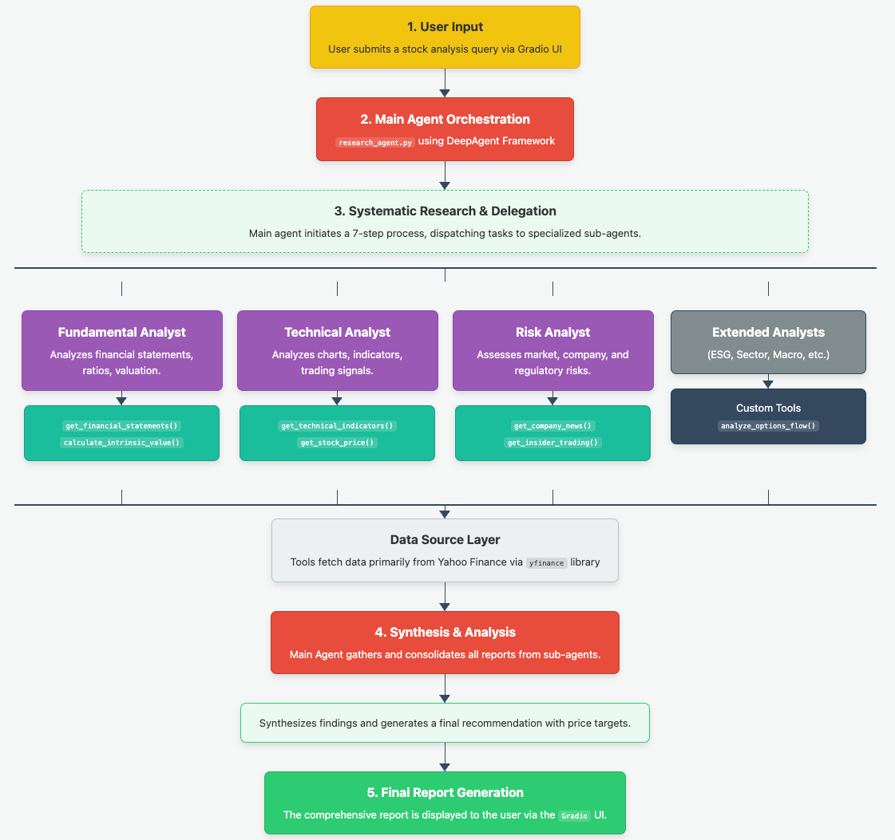
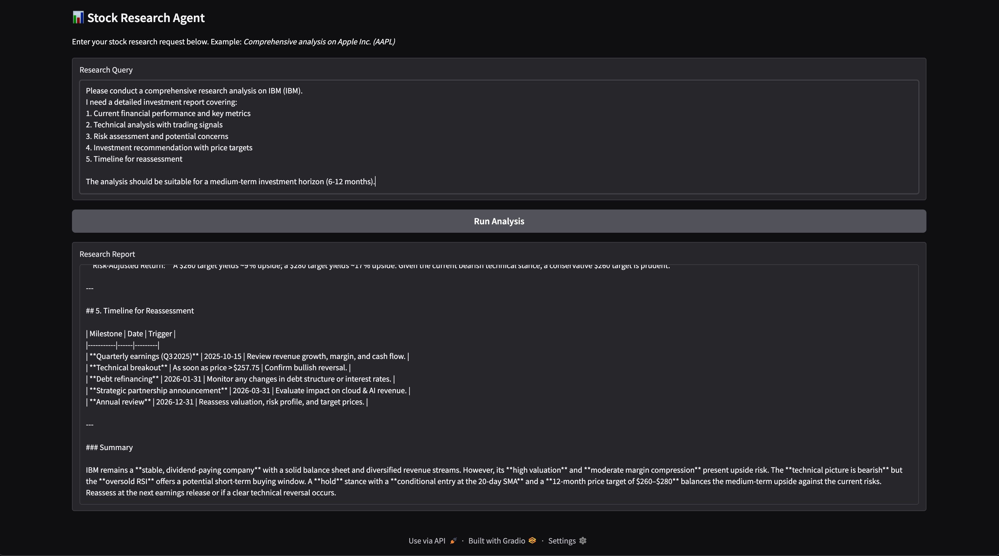

# DeepAgent Stock Research Assistant

> AI-powered stock research agent built with LangChain that provides comprehensive financial analysis.

[](https://www.python.org/downloads/)
[](https://langchain.com/)
[](LICENSE)

## Overview

This project demonstrates advanced AI research capabilities using LangChain agents. The system employs specialized analysis tools and systematic planning to deliver professional-grade stock analysis.



### Key Features

- **Multi-Perspective Analysis**: Combines fundamental, technical, and risk analysis
- **Real-Time Data**: Live stock prices, financial statements, and technical indicators  
- **Systematic Workflow**: Structured 7-step research methodology
- **Web Interface**: User-friendly Gradio interface
- **Professional Reports**: Investment recommendations with price targets

## Quick Start



1. **Clone the repository**
   ```bash
   git clone https://github.com/yourusername/deepagent-stock-research.git
   cd deepagent-stock-research
   ```

2. **Install dependencies**
   ```bash
   pip install -r requirements.txt
   ```

3. **Set up Ollama**
   ```bash
   # Install Ollama (if not already installed)
   curl -fsSL https://ollama.ai/install.sh | sh
   
   # Pull a model
   ollama pull gpt-oss
   ```

4. **Run the application**
   ```bash
   python research_agent.py
   ```

5. **Open your browser**
   Navigate to `http://localhost:7860`

## Usage

### Basic Analysis

Try this example query:

```
Analyze Apple Inc. (AAPL) for a 6-month investment horizon. 
Include current financial performance, technical analysis, 
risk assessment, and investment recommendation.
```

### Research Process

The agent follows a systematic 7-step approach:

1. **Initial Data Gathering** - Collect stock price, financial data
2. **Fundamental Analysis** - P/E ratios, growth metrics, valuation  
3. **Technical Analysis** - Chart patterns, indicators, entry/exit points
4. **Risk Assessment** - Market, operational, regulatory risks
5. **Competitive Analysis** - Industry positioning, peer comparison
6. **Synthesis** - Combine all findings into coherent thesis
7. **Recommendation** - Buy/sell/hold with price targets

## Architecture

```
User Input → Main Agent → Sub-Agents → Financial Tools → Analysis Report
                ↓              ↓              ↓
        Orchestrator    Fundamental    Stock Price API
                       Technical      Financial Data
                       Risk Analysis  Technical Indicators
```

## Dependencies

- `langchain` - Agent framework
- `langchain-ollama` - Local LLM integration  
- `yfinance` - Financial data
- `gradio` - Web interface
- `pandas` - Data processing


## Configuration

Key settings can be configured via environment variables:

- `OLLAMA_MODEL` - Model name (default: gpt-oss)
- `OLLAMA_HOST` - Ollama server URL
- `GRADIO_PORT` - Web interface port (default: 7860)

## License

MIT License - see [LICENSE](LICENSE) file for details.

## Contributing

1. Fork the repository
2. Create your feature branch (`git checkout -b feature/AmazingFeature`)
3. Commit your changes (`git commit -m 'Add some AmazingFeature'`)
4. Push to the branch (`git push origin feature/AmazingFeature`)
5. Open a Pull Request
